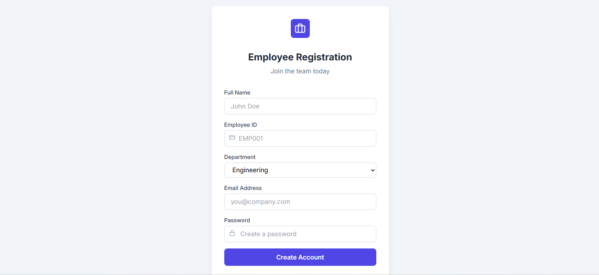
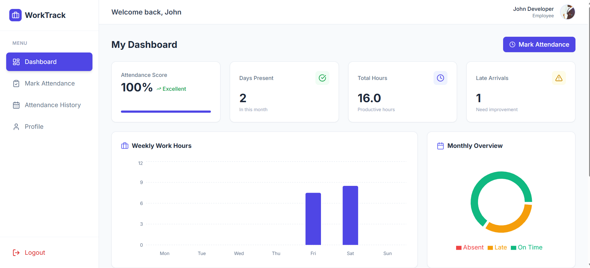
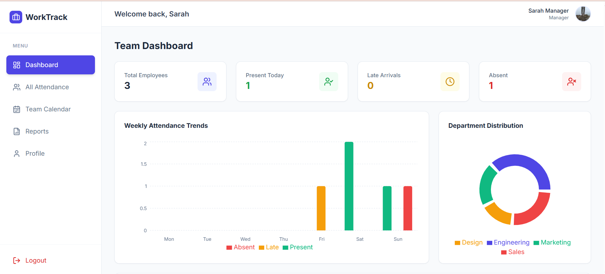
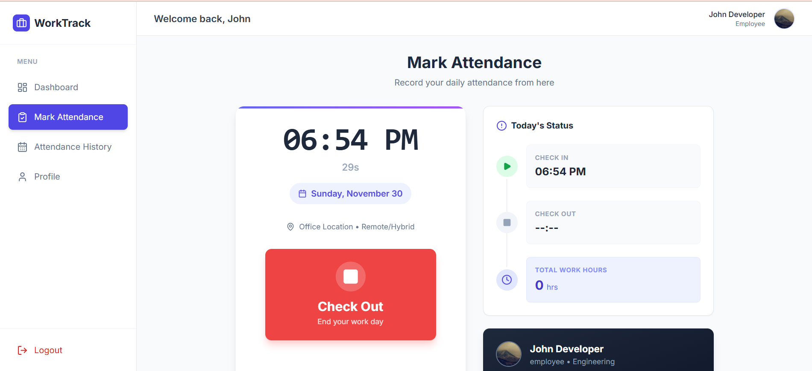
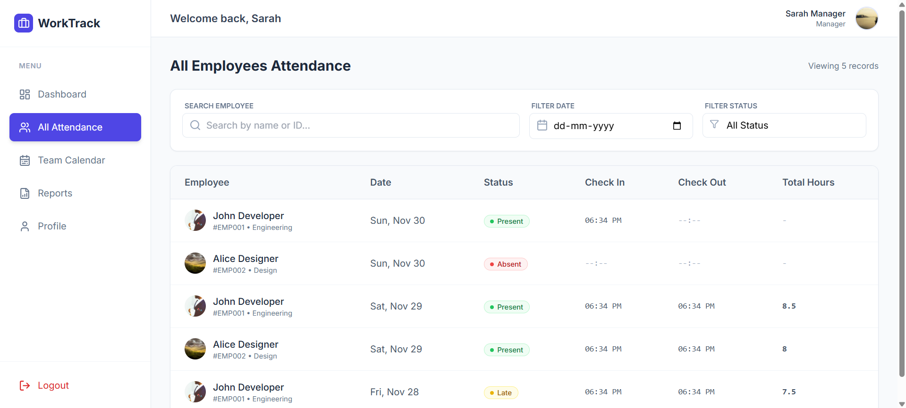
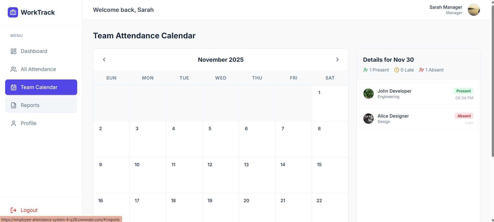

# Employee Attendance System

A full-stack web application to automate employee attendance tracking with role-based access control.  
Employees can mark daily check-in/check-out, while managers can view and generate attendance reports.

Demo Video- https://drive.google.com/file/d/1At5M2vQKrPRjthhFJWl496Z9VxEOcmGm/view?usp=drive_link
---

## Tech Stack
**Frontend:** React, TypeScript, Zustand  
**Backend:** Node.js, Express  
**Database:** MongoDB  
**Authentication:** JWT  
**Tools:** Git, VS Code, Postman

---

## ⚙ Setup Instructions

Clone the Project
git clone <repository-link>
cd employee-attendance-system
Install dependencies:

npm install

Create a .env file in the backend root directory with the following variables:

MONGO_URI=your_mongodb_connection_string
JWT_SECRET=your_secret_key
PORT=5000

Start the backend server:

npm start

or (if using nodemon)

npm run dev

Backend will run on:

http://localhost:5000

Default Login Credentials (Example)

For testing purposes, the seed data may include:

Manager Account:
Email: manager@gmail.com
Password: 123456

Employee Account:
Email: employee@gmail.com
Password: 123456

## Screenshots

## 📸 Project Screenshots

### 📝 Register Page  

### 🧑‍💼 Employee Dashboard  

### 👨‍💼 Manager Dashboard  

### 🕒 Mark Attendance  

### 👥 All Employees Attendance  

### 📅 Team Calendar  

